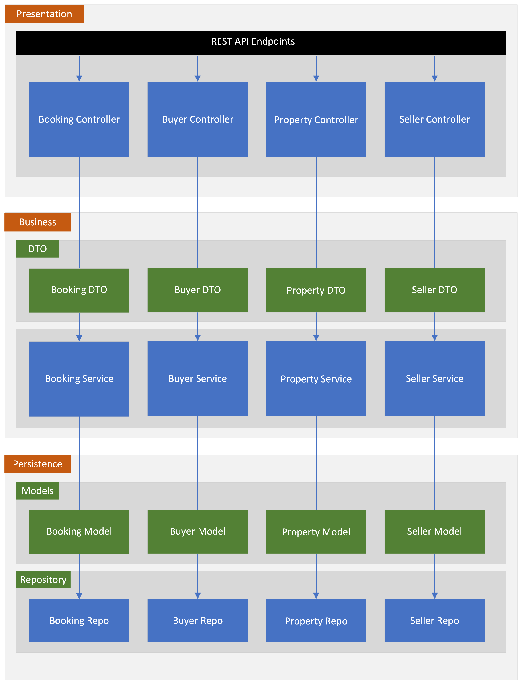

**&larr; [Back to Project 3 README](../README.md)**
# Architecture

<!-- TOC -->
  * [Overview](#overview)
  * [JSON <-> Entity Mapping](#json-----entity-mapping)
<!-- TOC -->
---
## Overview

The C# ASP.NET MVC Microservice reference answer uses a layer architecture as shown in Fig 1.  The three layers are:
- presentation
- business
- persistence

{width=500px}
<figcaption><b>Fig.1 - Application Architecture </b></figcaption>

## JSON <-> Entity Mapping
Data is passed from in to the endpoints from the WEB application as JSON which is automatically converted to stated C# Objects by ASP.NET.  However, JSON structures represent the view from frontend perspective and does not necessary match the actual database represented by the Entity objects.  Therefore, it is necessary to covert or _**map**_between JSON and Entity.  While this can be done manually by writing your own class, the provided example here uses the the AutoMapper library for this task.  This is demonstrated in the following code from the Program, EAAutoMapper and BookingService classes:

```C#
Program.cs:
  // Add services to the container.
  builder.Services.AddScoped<IBuyerService, BuyerService>();
  builder.Services.AddControllers();
  builder.Services.**AddAutoMapper(typeof(Program));**

EAAutoMapper.cs:
      public class EAAutoMapper:Profile
    {
        public EAAutoMapper()
        {
            CreateMap<BookingModel, BookingDTO>();
            CreateMap<BookingDTO, BookingModel>();
        }
    }
```
{width=500px}
<figcaption><b>Fig.2 - JSON <-> Entity Mapping </b></figcaption>

